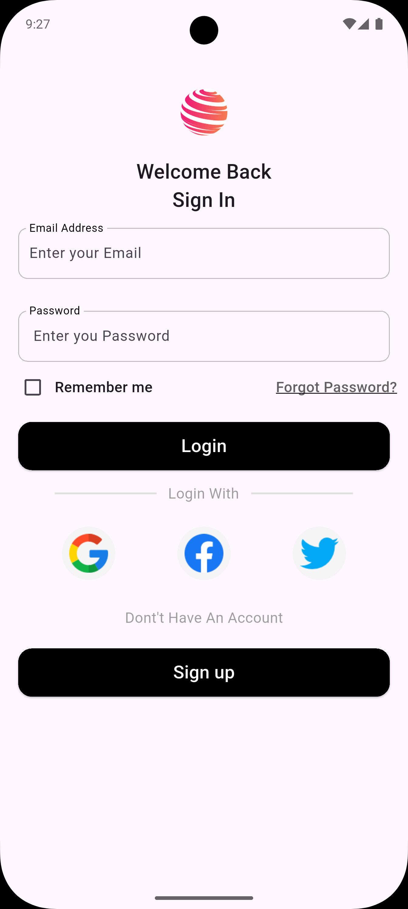
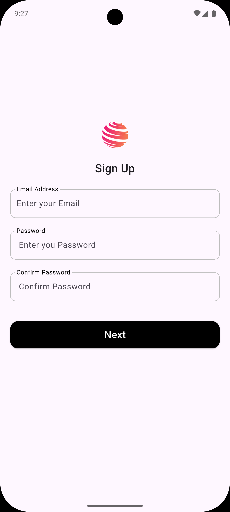
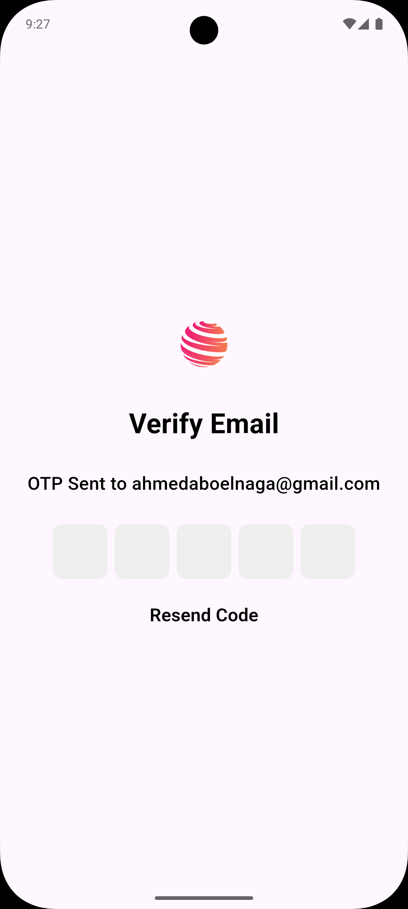

# Auth

A modern, secure, and user-friendly authentication app built with **Flutter**. Auth provides seamless login and signup experiences using [Firebase Authentication](https://firebase.google.com/docs/auth), supporting multiple providers, email/password, and OTP-based signups. Perfect as a starting point for any project that requires robust user authentication.

---

## ✨ Features

- 🔒 **Email & Password Authentication**
- 🌐 **Social Logins:** Google, Facebook, and Twitter
- 📧 **Signup with Email OTP**
- 📄 **Collect Personal Information during Signup**
- 🎨 **Modern and Responsive UI**
- 🚀 **Powered by Firebase Auth**

---

## Screenshots

   &nbsp;&nbsp;&nbsp;  &nbsp;&nbsp;&nbsp;  &nbsp;&nbsp;&nbsp;

## 🚀 Getting Started

### Prerequisites

- [Flutter](https://docs.flutter.dev/get-started/install)
- [Firebase Project](https://console.firebase.google.com/)
- Social authentication credentials (Google, Facebook, Twitter)

### Setup

1. **Clone the repository:**
   ```bash
   git clone https://github.com/AhmedAbdElrahman117/Auth.git
   cd Auth
   ```

2. **Install packages:**
   ```bash
   flutter pub get
   ```

3. **Configure Firebase:**
   - Add your `google-services.json` (Android) and `GoogleService-Info.plist` (iOS) files.
   - Enable Email/Password, Google, Facebook, and Twitter sign-in methods in [Firebase Console](https://console.firebase.google.com/).

4. **Run the app:**
   ```bash
   flutter run
   ```

---

## 🛠️ Built With

- [Flutter](https://flutter.dev/) – Cross-platform UI toolkit
- [Firebase Auth](https://firebase.google.com/docs/auth)
- [Dart](https://dart.dev/)

---

## 📬 Contribution

Contributions are welcome! Please open issues and submit pull requests for improvements or bug fixes.

1. Fork the repository
2. Create a new branch (`git checkout -b feature/your-feature`)
3. Commit your changes (`git commit -am 'Add new feature'`)
4. Push to the branch (`git push origin feature/your-feature`)
5. Open a Pull Request

---

## ⚖️ License

This project is licensed under the MIT License. See the [LICENSE](LICENSE) file for details.

---

## 🙏 Acknowledgements

- [Flutter Community](https://flutter.dev/community)
- [Firebase Documentation](https://firebase.google.com/docs/auth)
- All contributors!
